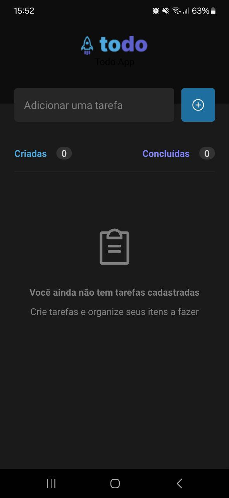
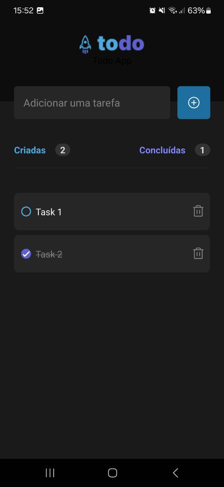

<p align="center">
  
</p>

<p align="center">
    <strong>Aplicativo React Native.</strong>
</p>

<p align="center">
  
  
  
  
</p>

<p align="center">
 <a href="#-sobre-o-projeto">Sobre</a> •
 <a href="#-funcionalidades">Funcionalidades</a> • 
 <a href="#-layout">Layout</a> • 
 <a href="#-tecnologias-utilizadas">Tecnologias</a> • 
 <a href="#-instalação-e-uso">Instalação</a> • 
 <a href="#-licença">Licença</a>
</p>

<h4 align="center"> 
	🚧  Projeto concluído 🚀 🚧
</h4>

## 💻 Sobre o projeto

Todo App foi criado com o intuíto de testar meus conhecimentos em ReactNative.

## ☑ Funcionalidades

- [x] Inserir tarefas
- [x] Alterar estado da tarefa
- [x] Marcar como concluído
- [x] Apagar tarefa


## 🎨 Layout
<a href="https://www.figma.com/file/1XfZQGSWk4HWjvwcjd2nOP/ToDo-List/duplicate">Figma do projeto</a>
<br>


<p align="left">
  
  
</p>

## 🔨 Tecnologias utilizadas

As seguintes ferramentas foram usadas na construção do projeto:

- **[ReactJS](https://reactjs.org/)**
- **[TypeScript](https://www.typescriptlang.org/)**
- **[Vite](https://vitejs.dev/)**
- **[Expo](https://expo.dev/)**


## 🚀 Instalação e uso

```bash
# Clone o repositório
git clone https://github.com/ArielKollross/todo-list-react-native.git

# Acesse a pasta do projeto
cd todo-list-react-native

# Instale as dependências
npm install

# Execute a aplicação
npm run start

```


## 📝 Licença

<a href="https://opensource.org/licenses/MIT">
    
</a>

Esse projeto está sob a licença MIT. Veja o arquivo [LICENSE](./LICENSE.md) para mais detalhes.
